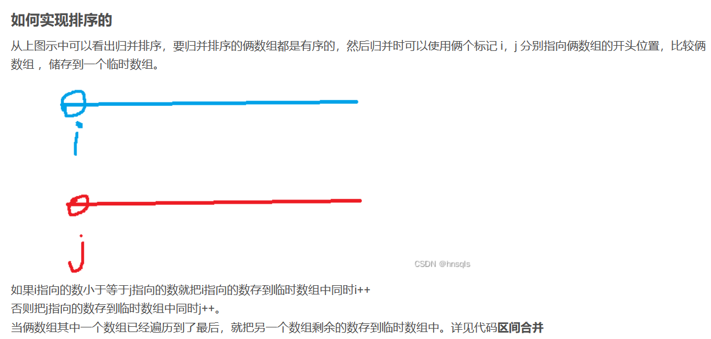
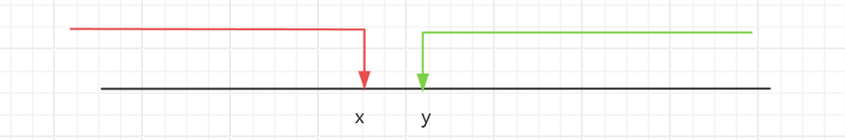

# 1.快速排序

**思想**： 

* 取一个基准数，将需要排序的序列划分为左右两区间
* 调整排序，例如增序，使得左边的区间都小于基准数，使得右边的区间都大于基准数
* 递归左右区间，直到区间只有一个元素（有序）。

```c++
int a[];
void quick_sort(int a[],int l, int r){
    if(l >= r) return;
    int i = l - 1, j = r + 1;
    int x = a[(l + r) / 2];
    while(i < j){
        do i++;while(a[i] < x);//从左向右找到第一个不小于x的元素
        do j--;while(a[j] > x);//从左向右找到第一个不大于x的元素
        if(i < j) swap(a[i],a[j]);//交换两数，使得在应该在的区间。
    }
    //经过上边while循环后，区间左边都小于x,区间右边都大于x。
    quick_sort(a,l,j),quick_sort(a,j+1,r);//递归处理左右两边
}
```

题目：[785. 快速排序 - AcWing题库](https://www.acwing.com/problem/content/787/)

# 2.归并排序

**思路**

* 递归划分左右区间直到区间只有一个数（有序）
* 合并区间用两个指针分别指向两区间的开头，依次扫描按照从小到大（增序）存入临时数组
* 将临时数组的值赋值给原数组。

图示：




```c++
int a[N],tmp[N];
void merge_sort(int a[],int l,int r)
{
    // 递归的出口  当数组只有一个元素时 不在划分区间
    if(l == r) return ;
    
    //1  递归划分区间   以 mid 为中点 划分左右区间 直到区间只有一个数
    int mid = l + r >>1;
    merge_sort(a,l,mid),merge_sort(a,mid + 1, r);
    
    //2 区间合并
    int i =l, j = mid +1, k = 0;    //  俩区间合并 i，j 分别指向俩区间的开头 tmp[k]临时储存俩区间合并的数组
    
    while(i <= mid && j <= r)        // i , j 分别从俩区间的开头移动
    {
        if(a[i] <= a[j]) tmp[k++] = a[i++];  // i 下标的数组 小于等于 j 下标的数组 tmp[k]储存 i，k向后移动
        else tmp[k++] = a[j++];               //  否则 就tmp[k] 储存a[j]的值  j,k 向后移动 
        
    }                                       // 当俩区间有一个区间排序完后 跳出循环
    while(i <= mid) tmp[k++] = a[i++];       //  第二区间完成排序 ，第一个区间还留有数组 tmp[]储存剩余数组
    while(j <= r) tmp[k++] = a[j++];        //  第一区间完成排序 ，第二个区间还留有数组  tmp[]储存剩余数组
    
    //4 将排好序的数组（临时数组） 复制给要排序的原数组
    for(int i = l, j=0;i <= r; i ++, j ++)
    a[i] = tmp[j];
}

```

题目：[788. 逆序对的数量 - AcWing题库](https://www.acwing.com/problem/content/790/)


# 3.二分

* 对于有序区间（或者是连续满足某种性质的区间）,存在边界点，不满足这种性质。
* 如图所示x的左边包括x都满足红色性质，y右边包括y都满足绿色性质。



* 我们可以根据这种性质调整区间以简化时间复杂度。

```c++
bool check(int x){
      //检查x是否满足某种性质，可写可不写，在判断时直接替换
}
 
//当需要二分的区间为红色区间，即[0,x]时候
 
int bsearch_1(int l,int r){  //l和r为边界
    while(l<r){
        int mid=l+r+1>>1;  //mid下取整，若不补上+1，当l=r-1时，mid=l,若此时恰好check(mid)为true时会死循环
        if(check(mid)) l=mid;  //若为true则说明实际边界在mid右边，故更新左边界为mid
        else r=midr-1;  //否则实际边界在mid左边，且不包含mid
    }
    return l;
}
 
//当需要二分的区间为绿色区间，即[y,n]
 
int bsearch_2(int l,int r){
    while(l<r){
        inr mid=l+r>>1;
        if(check(mid)) r=mid;  //若为true则说明实际边界在mid左边，故更新右边界为mid
        else l=mid+1;  //否则实际边界在mid右边，且不包含mid
    }
    return l;
}
```

需要注意的是，根据题目我们所求边界根据我们定义的性质包不包含边界点。

题目：[AcWing 789. 数的范围 - AcWing](https://www.acwing.com/activity/content/problem/content/823/)

[AcWing 790. 数的三次方根 - AcWing](https://www.acwing.com/activity/content/problem/content/824/)

# 4. 高精度加法

* 用数组存储数据
* 模拟加法

如  189 + 42

* 个位 9 + 2 = 11。进1余1。
* 十位 8 + 4 + 1（进位） = 13。进1余3。
* 百位 1 + 1（进位）= 2。
* 结果是231。

算法 189 + 42

* 将189 和42 倒序存储到数组中 A = [9,8,1],B = [2,4]。
* A[0] + B[0] = 9 + 2 = 11。答案用数组C存贮，进位用t表示，C[0] =  sum % 10  = 1,t = sum /10 = 1;
* A[1] + B[1] + t= 8 + 4 + 1 =  13。 C[1] = sum %10 = 3,t = sum / 10 = 1;
* A[2] + t = 1 + 1 = 2。C[2] = sum %10= 2,t = 0。
* 答案是C = [1,3,2],倒叙输出就是231。
* tips：两数组模拟相加完，最后要判断t是不是还有。如93+7 =100。

```c++
#include<iostream>
#include<vector>

using namespace std;
vector<int> add(vector<int> &A,vector<int> &B){
    vector <int> C; //接收数据
    if(B.size() > A.size()) swap(A,B); //长的数在前面，方便下面计算
    int t = 0; //t标识进位数，在下面代码过程中，也充当 A[i] + B[i] + t 的和
    for(int i = 0; i < A.size(); i ++){
        t += A[i];
        if(i < B.size()) t+=B[i];
        C.push_back(t%10);
        t = t/10;
    }
    //检查余数
    if(t) C.push_back(t);
    return C;
    
}
int main()
{
    vector<int> A,B,C;
    string a,b;
    cin>>a>>b;
    for(int i = a.size() - 1; i >= 0; i --) A.push_back(a[i] - '0');
    for(int i = b.size() - 1; i >= 0; i --) B.push_back(b[i]- '0');
    C = add(A,B);
    for(int i = C.size() - 1; i >= 0; i --) cout<<C[i];
    return 0;
}
```

[791. 高精度加法 - AcWing题库](https://www.acwing.com/problem/content/description/793/)

# 5. 高精度减法

思路：模拟人进行减法的步骤，和上述加法基本相同。

加法计算的时候进位或者不进位都是上述每一位数的和都是`sum = (a[i]+b[i]+ t（上一位的进位）) `，改位进位都是`t = sum / 10`(t表进位)。

减法借位或者不借位每一位数的插值计算有两种情况:

情况一：不需要借位即`a[i] - b[i] - t(上一位的进位) >= 0`时`sub = a[i] - b[i]- t`，那么该位借位t =0;

情况二:`a[i] - b[i] - t < 0 `需要借位时`sub = a[i] - b[i] - t + 10`,那么该借位t = 1。

这里有个巧妙的思想，可以将上述情况一网打尽。**正数+10余10还是正数本身**。利用这个思想我们可以简化上述代码。在计算的时候无论插值时正数还是负数，都加上10，在余10,获得存在该位的结果，至于进位就判断插值即可。

```c++
#include<iostream>
#include<vector>
using namespace std;
//判断A是否大于等于B
bool cmp (vector <int> A,vector <int> B)
{
    if(A.size() != B.size())  return A.size() > B.size();
    for(int i = A.size() - 1 ; i >= 0; i --)
    {
        if(A[i] != B[i]) return A[i] > B[i];
    }
    return true;
}
vector <int> sub(vector <int> &A, vector <int> &B)
{
    vector<int> C;
    
    int t = 0; //进位，同时在计算过程中存差值
    for(int i = 0; i < A.size(); i ++)
    {
        t =A[i] -t;
        if(i < B.size()) t -=B[i]; 
        C.push_back((t+10)%10);
        if(t < 0) t = 1;
        else t = 0;
    }
    //因为结果是反着存，最高位不能为0，删除最高位的0。
    while(C.size() > 1&& C.back() == 0) C.pop_back();

    return C;
}
int  main()
{
    vector<int> A,B,C;
    string a,b;
    cin>>a>>b;
    for(int i = a.size() - 1 ; i >= 0; i -- ) A.push_back(a[i] - '0');
    for(int i = b.size() - 1 ; i >= 0; i -- ) B.push_back(b[i] - '0');
    if(!cmp(A,B)){
        cout<<"-";
        swap(A,B);
    }
    C = sub(A,B);
    for(int i = C.size() - 1 ; i >= 0; i -- ) cout<<C[i];
    return 0;
}

```

此模板默认都是正整数，并且没有前导0数据。

[792. 高精度减法 - AcWing题库](https://www.acwing.com/problem/content/794/)