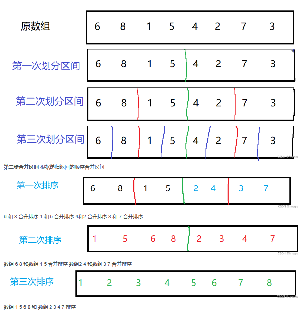

# 1.快速排序

**思想**： 

* 取一个基准数，将需要排序的序列划分为左右两区间
* 调整排序，例如增序，使得左边的区间都小于基准数，使得右边的区间都大于基准数
* 递归左右区间，直到区间只有一个元素（有序）。

```c++
int a[];
void quick_sort(int a[],int l, int r){
    if(l >= r) return;
    int i = l - 1, j = r + 1;
    int x = a[(l + r) / 2];
    while(i < j){
        do i++;while(a[i] < x);//从左向右找到第一个不小于x的元素
        do j--;while(a[j] > x);//从左向右找到第一个不大于x的元素
        if(i < j) swap(a[i],a[j]);//交换两数，使得在应该在的区间。
    }
    //经过上边while循环后，区间左边都小于x,区间右边都大于x。
    quick_sort(a,l,j),quick_sort(a,j+1,r);//递归处理左右两边
}
```

题目：[785. 快速排序 - AcWing题库](https://www.acwing.com/problem/content/787/)

# 2.归并排序

**思路**

* 递归划分左右区间直到区间只有一个数（有序）
* 合并区间用两个指针分别指向两区间的开头，依次扫描按照从小到大（增序）存入临时数组
* 将临时数组的值赋值给原数组。

图示：




```c++
int a[N],tmp[N];
void merge_sort(int a[],int l,int r)
{
    // 递归的出口  当数组只有一个元素时 不在划分区间
    if(l == r) return ;
    
    //1  递归划分区间   以 mid 为中点 划分左右区间 直到区间只有一个数
    int mid = l + r >>1;
    merge_sort(a,l,mid),merge_sort(a,mid + 1, r);
    
    //2 区间合并
    int i =l, j = mid +1, k = 0;    //  俩区间合并 i，j 分别指向俩区间的开头 tmp[k]临时储存俩区间合并的数组
    
    while(i <= mid && j <= r)        // i , j 分别从俩区间的开头移动
    {
        if(a[i] <= a[j]) tmp[k++] = a[i++];  // i 下标的数组 小于等于 j 下标的数组 tmp[k]储存 i，k向后移动
        else tmp[k++] = a[j++];               //  否则 就tmp[k] 储存a[j]的值  j,k 向后移动 
        
    }                                       // 当俩区间有一个区间排序完后 跳出循环
    while(i <= mid) tmp[k++] = a[i++];       //  第二区间完成排序 ，第一个区间还留有数组 tmp[]储存剩余数组
    while(j <= r) tmp[k++] = a[j++];        //  第一区间完成排序 ，第二个区间还留有数组  tmp[]储存剩余数组
    
    //4 将排好序的数组（临时数组） 复制给要排序的原数组
    for(int i = l, j=0;i <= r; i ++, j ++)
    a[i] = tmp[j];
}

```

题目：[788. 逆序对的数量 - AcWing题库](https://www.acwing.com/problem/content/790/)


# 3.整数二分

* 对于有序区间（或者是连续满足某种性质的区间）,存在边界点，不满足这种性质。
* 如图所示x的左边包括x都满足红色性质，y右边包括y都满足绿色性质。


* 我们可以根据这种性质调整区间以简化时间复杂度。

```c++
bool check(int x){
      //检查x是否满足某种性质，可写可不写，在判断时直接替换
}
 
//当需要二分的区间为红色区间，即[0,x]时候
 
int bsearch_1(int l,int r){  //l和r为边界
    while(l<r){
        int mid=l+r+1>>1;  //mid下取整，若不补上+1，当l=r-1时，mid=l,若此时恰好check(mid)为true时会死循环
        if(check(mid)) l=mid;  //若为true则说明实际边界在mid右边，故更新左边界为mid
        else r=midr-1;  //否则实际边界在mid左边，且不包含mid
    }
    return l;
}
 
//当需要二分的区间为绿色区间，即[y,n]
 
int bsearch_2(int l,int r){
    while(l<r){
        inr mid=l+r>>1;
        if(check(mid)) r=mid;  //若为true则说明实际边界在mid左边，故更新右边界为mid
        else l=mid+1;  //否则实际边界在mid右边，且不包含mid
    }
    return l;
}
```

需要注意的是，根据题目我们所求边界根据我们定义的性质包不包含边界点。

题目：[AcWing 789. 数的范围 - AcWing](https://www.acwing.com/activity/content/problem/content/823/)

[AcWing 790. 数的三次方根 - AcWing](https://www.acwing.com/activity/content/problem/content/824/)