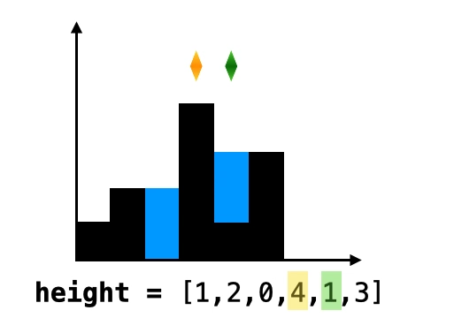

# Hot100

## 哈希

### [1. 两数之和 - 力扣（LeetCode）](https://leetcode.cn/problems/two-sum/submissions/552565189/?envType=study-plan-v2&envId=top-100-liked)

* map维护已经遍历的数值和下标
* 判断遍历的当前数的值`nums[i]`满足 `taget-nums[i]`存在map中。
* 存在则返回 当前下标和map中满足条件的下标
* 不存在则加入到map中
* 都不满足  null

```java
class Solution {
     public int[] twoSum(int[] nums, int target) {
        HashMap<Integer, Integer> map = new HashMap<>();
        for (int i = 0; i < nums.length; i++) {
            if (map.containsKey(target-nums[i])){
                return new int[] {i,map.get(target-nums[i])};
            }
            map.put(nums[i],i);
        }
        return null;
    }
}
```

### [49. 字母异位词分组 - 力扣（LeetCode）](https://leetcode.cn/problems/group-anagrams/description/?envType=study-plan-v2&envId=top-100-liked)

* map
* map 维护每个字符串字典序排序后的字符串（K） 和对应组的集合List（V）

```java
class Solution {
    public List<List<String>> groupAnagrams(String[] strs) {
            HashMap<String, List<String>> map = new HashMap<>();
            for (int i = 0; i < strs.length; i++) {
                //字典序排序，
                char[] t = strs[i].toCharArray();
                Arrays.sort(t);
                //是否该组存在map中
                String k = String.valueOf(t);
                if (map.containsKey(k)){
                    //存在这样的组，加入这组对应的集合中
                    map.get(k).add(strs[i]);
                }else {
                    //不存在这样的组，自己成为一组，并加入到改组的集合
                    ArrayList<String> list = new ArrayList<>();
                    list.add(strs[i]);
                    map.put(k,list);
                }
            }

            //返回结果
            ArrayList<List<String>> res = new ArrayList<>();
            for (Map.Entry<String,List<String>> entry : map.entrySet()){
                res.add(entry.getValue());
            }
            return  res;
        }
}
```

### [128. 最长连续序列 - 力扣（LeetCode）](https://leetcode.cn/problems/longest-consecutive-sequence/submissions/552612065/?envType=study-plan-v2&envId=top-100-liked)

* set去重
* 找到最长序列的起始位置 满足`nums[i] -1` 不在set中就是起始位置
* 从起始位置开始，遍历set直到不满足连续。

```java
class Solution {
      public int longestConsecutive(int[] nums) {

        //set去重
        HashSet<Integer> set = new HashSet<>();
        for (int num : nums) {
            set.add(num);
        }
        int max = 0;
        for (int num : nums) {
            //遍历数组nums[i] 是否满足nums[i]-1 在set中
            // *      若不在，该数字就是最长连续的起始位置 
            if (!set.contains(num-1)){
                // 若不在，该数字就是最长连续的起始位置 从起始位置开始，遍历set直到不满足连续。
                int t = num;
                int cnt = 1;
                while (set.contains(t + 1)){
                    t++;
                    cnt++;
                }
                 max = Math.max(max, cnt);
            }
        }
        return max;
    }
    }
```

## 双指针

### [283. 移动零 - 力扣（LeetCode）](https://leetcode.cn/problems/move-zeroes/description/?envType=study-plan-v2&envId=top-100-liked)

 * 题意：保持数组元素排序不变，将0元素移到最后并且不能复制数组
 * 思路
 *   双指针
 *   i 从前向后遍历
 *   j 从头开始，意义是非0元素可以插入的位置
 *   当 i指向非0元素时，nums[i]插入到j指向的位置 nums[j]的值保存在i指向的位置，并且j++
 *   这样经过一次循环，前面的数组都是按照原位置，并且0在最后的位置。

```java
class Solution {
        public void moveZeroes(int[] nums) {
        for(int i = 0 ,j = 0; i <nums.length; i++){
            if (nums[i] != 0){
                int t = nums[i];
                nums[i] = nums[j];
                nums[j] = t;
                j++;
            }
        }
    }
}
```

### [11. 盛最多水的容器 - 力扣（LeetCode）](https://leetcode.cn/problems/container-with-most-water/?envType=study-plan-v2&envId=top-100-liked)

 * 思路
 * 双指针
 * l指向左边，r 指向右边
 * l从左向右遍历，r从右向左遍历
 * l，r 的更新规则是:`min(Height[l],Height[r])`那边值低，不要那边即更新那边

```java
class Solution {
  public int maxArea(int[] height) {
        int l = 0 , r = height.length - 1;
        int area = 0;
        while(l < r){
            int t = (r - l) * Math.min(height[l],height[r]);
            area = Math.max(area,t);
            if (height[l] <= height[r]) l++;
            else r --;
        }
        return area;
    }
}
```


### [15. 三数之和 - 力扣（LeetCode）](https://leetcode.cn/problems/3sum/description/?envType=study-plan-v2&envId=top-100-liked)

* 思路
* 排序 + 双指针
* 排序，将数组从小到大排序
* 设nums[i] 为三数之和为0的最小元素
* 在i的右边查找其他两数。`l= i + 1` ,` r = nums.length -1`
* `nums[i] > 0`. 最小数都大于0，三种相加肯定不满足等于0，没答案,之后也没答案，直接返回答案即可
* `nums[i] + nums[l] +nums[r] > 0 `,说明其他两数和我们需要的数大，而nums[j]已经是最小了，只能移动r， r--;
* `nums[i] + nums[l] +nums[r] <0` , l++
* nums[i] + nums[l] +nums[r] = 0 ,就是答案,加入到答案集合中
* 由于要的答案不能重复，所以当我们找寻到一个答案时候，首先加入答案，
* 然后由于我们排序过，所以相同的元素一定在一起,调整i,j,k

```java
class Solution {
    public List<List<Integer>> threeSum(int[] nums) {
        ArrayList<List<Integer>> ans = new ArrayList<>();
        //排序，将数组从小到大排序
        Arrays.sort(nums);
        //设nums[i] 为三数之和为0的最小元素
        for (int i = 0; i < nums.length - 1; i++) {
            //nums[i] > 0. 最小数都大于0，三种相加肯定不满足等于0，没答案
            // 之后的的数都大于，直接返回结果
            if (nums[i] > 0) {
                return ans;
            }
            int l = i + 1, r = nums.length - 1;
            //双指针
            while (l < r) {
                int t = nums[i] + nums[l] + nums[r];
                // * nums[i] + nums[j] +nums[k] <0 ,j++
                if (t < 0) l++;
                //nums[i] + nums[j] +nums[k] > 0 ,说明其他两数和我们需要的数大，而nums[j]已经是最小了，只能移动k， k--;
                if (t > 0) r--;
                //nums[i] + nums[j] +nums[k] = 0 ,就是答案
                if (t == 0) {
                    ArrayList<Integer> list = new ArrayList<>();
                    list.add(nums[i]);
                    list.add(nums[l]);
                    list.add(nums[r]);
                    ans.add(list);
                    //调整j,k元素
                    while (l + 1 < r && nums[l] == nums[l + 1]) l++;
                    while (r - 1 > l && nums[r] == nums[r - 1]) r--;
                    l++;
                    r--;
                }
            }
                //调整i元素
                while (i + 1 < nums.length && nums[i] == nums[i + 1]) i++;
            }
        //返回List<List<Integer>>元素类型
        return ans;
    }
}
```


### [42. 接雨水 - 力扣（LeetCode）](https://leetcode.cn/problems/trapping-rain-water/description/?envType=study-plan-v2&envId=top-100-liked)

* 双指针
* 左指针l从左向右遍历,右指针r从右向左遍历
* 若`height[l] < height[r]` 说明蓄水依赖于左边，那么查看依赖于左边构成的凹槽蓄水
  * 记录一下左边依赖的值即为`left_max`  `l++; 查看是否height[l] < left_max`
    * 若满足`height[l] <left_max` 说明构成凹槽，记录答案 `ans += left_max -height[l]`
    * 若不满足小于条件，说明构不成凹槽而是凸槽或者平槽，不能蓄水。并更新`left_max = height[l]`
* 若`height[l] > height[r]` 说明蓄水依赖于左边，那么查看依赖于右边构成的凹槽蓄水。
  * 记录一下右边边依赖的值即为`right_max`  `r--; 查看是否height[r] < right_max`
    * 若满足`height[r] <left_max` 说明构成凹槽，记录答案 `ans += left_max -height[r]`
    * 若不满足小于条件，说明构不成凹槽而是凸槽或者平槽，不能蓄水。并更新`left_max = height[l]`
* 当 l = r 循环结束



```java
class Solution {
 public int trap(int[] height) {
        int res = 0;
        int l = 0, r = height.length - 1, l_max = 0, r_max = 0;
        while (l < r){
            if (height[l] < height[r]){
                if (height[l] < l_max){
                    res += l_max-height[l];
                }else {
                    l_max = height[l];
                }
                l++;
            }else {
                if (height[r] < r_max){
                    res += r_max-height[r];
                    
                }else {
                    r_max = height[r];
                }
                r --;
            }
        }
        return res;
    }
}
```


