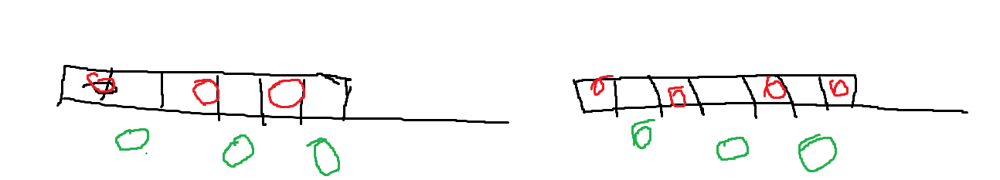
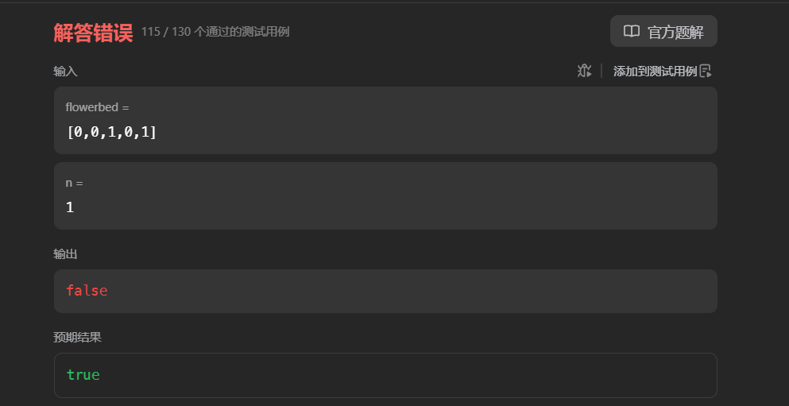
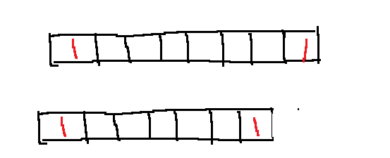
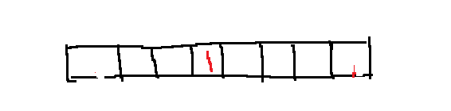
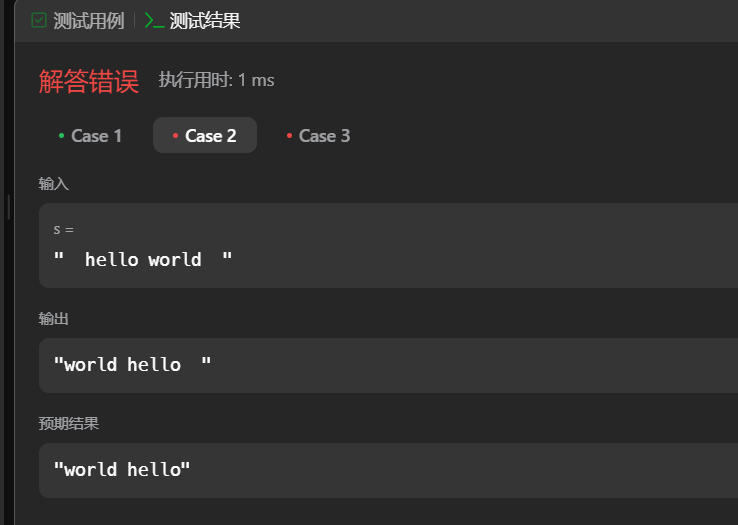

# LeetCode 75

## [1768. 交替合并字符串 - 力扣（LeetCode）](https://leetcode.cn/problems/merge-strings-alternately/description/?envType=study-plan-v2&envId=leetcode-75)

题目描述

​	两个字符串，每个字符串都拆成字符，交替拼接，长的字符串（剩余的字符） 拼接其后。

思路

* 根据短字符的长度进行遍历，最后拼接上长字符的剩余字符

```java
class Solution {
    public String mergeAlternately(String word1, String word2) {
        int minSize = Math.min(word1.length(),word2.length());

        StringBuilder res = new StringBuilder();
        
        for(int i = 0 ;i < minSize ;i ++){
            res.append(word1.charAt(i));
            res.append(word2.charAt(i));
        }
        // 处理剩余字符
        if(word1.length() > minSize){
            res.append(word1.substring(minSize));
        }
        // 处理剩余字符
        if(word2.length() > minSize){
             res.append(word2.substring(minSize));
        }
        return res.toString();
        
    }
}
```

## [1071. 字符串的最大公因子 - 力扣（LeetCode）](https://leetcode.cn/problems/greatest-common-divisor-of-strings/description/?envType=study-plan-v2&envId=leetcode-75)

题目描述

​	给出两个字符串，找出最长的公因子（比如  str1 = "ABCABC", str2 = "ABC"， 则最长公因子是“ABC”）


思路

* 最长公因子，最长也就是短串

优化思路

* str1 + str2 = str2 + str1 的时候才会有解，因为有解的情况下，str1可以被除尽，str2也可以被除尽，当然str1+str2 可以被除尽。
* 如果存在这样的字符串x，那么x的长度必须是两个字符串长度的公约数。


```java
class Solution {
    public String gcdOfStrings(String str1, String str2) {
        // 检查两个字符串连接后是否相等 // 假设str1是N个x，str2是M个x，那么str1+str2肯定是等于str2+str1的。
        if (!(str1 + str2).equals(str2 + str1)) {
            return "";
        }
        // 计算两个字符串长度的最大公约数
        int gcdLength = gcd(str1.length(), str2.length());
       
        // 返回最大公约数长度的前缀子串
        return str1.substring(0, gcdLength);
    }
    
    // 计算最大公约数的辅助方法
    private int gcd(int a, int b) {
        while (b != 0) {
            int temp = b;
            b = a % b;
            a = temp;
        }
        return a;
    }
}
```


## [1431. 拥有最多糖果的孩子 - 力扣（LeetCode）](https://leetcode.cn/problems/kids-with-the-greatest-number-of-candies/?envType=study-plan-v2&envId=leetcode-75)

题目描述

​	一群孩子每个有都拥有n个糖果，现在你有m个糖果，你选择将糖果给某个孩子，判断该孩子是不是拥有最多的糖果数


思路

* 先找出最多拥有的糖果数
* 遍历如果将自己的糖果全部给该孩子，是否小于最多的糖果数。

```java
class Solution {
    public List<Boolean> kidsWithCandies(int[] candies, int extraCandies) {
        int temp = 0;
        for(int i = 0; i < candies.length; i ++){
            if(candies[i] >= temp){
                temp = candies[i];
            }
        }

        List res = new ArrayList<Boolean>(candies.length);
         for(int i = 0; i < candies.length; i ++){
            if(candies[i] + extraCandies >= temp){
                res.add(true);
            }else{
                res.add(false);
            }
        }

        return res;
    }
}
```


## [605. 种花问题 - 力扣（LeetCode）](https://leetcode.cn/problems/can-place-flowers/description/?envType=study-plan-v2&envId=leetcode-75)

题目描述

​	 一个数组，已经存在一部分元素（不能相邻存在元素），要求插入n个元素，但是不能相邻，判断该n个元素是否能插入。


思路

* 根据数组大小判断最多可以存多少元素
  * 比如说偶数组长度n，最多只能存 n/2.
  * 奇数，可以存n/2 或者 n/ 2 + 1.(根据第一个元素)------有问题不能这莫分析
  * 

```java
class Solution {
    public boolean canPlaceFlowers(int[] flowerbed, int n) {
        int cnt = 0; // 计数
        for(int i = 0; i< flowerbed.length;i ++){
            if(flowerbed[i] == 1)
            {
                cnt ++;
            }
        }
        // 最多可以存
        //偶数
        int max= 0;
        if(flowerbed.length  % 2 == 0){
            max = flowerbed.length / 2;
        }
        // 奇数
        else{
            if(flowerbed[0] == 1){
                max = flowerbed.length/ 2 +1;
            }
            else{
                max = flowerbed.length / 2;
            }
        }
        if(cnt + n > max){
            return false;
        }
        return true;
    }
}
```

错误



分析：思路有问题，我上述的设想奇数长度的大小，最多可以判断只有在开头种植了才能+1,忽略了结尾，比如上述。

经过实验，对于过一个数组，间隔插入的最大值： 偶数长度 n/2, 奇数长度 (n+1)/2.

但是对于已经存在数据的数组，就不能按上述计算，因为，插入的位置同时可以在偶数位置并且在奇数位置上。


优化思路

* 查找数组的连续0
* 连续0在中间 最多可以插入 (n -1）/ 2 
* 连续0 在两边， 最多可以插入 n / 2 

如下图

连续0在数组的中间的情况：



连续0在数组两边的情况：




优化思路

* 贪心，能种就种


```java
class Solution {
    public boolean canPlaceFlowers(int[] flowerbed, int n) {
        int count = 0;
        int i = 0;
        while (i < flowerbed.length) {
            if (flowerbed[i] == 0) {
                boolean canPlace = (i == 0 || flowerbed[i - 1] == 0) &&  // 左边没有花或是数组开头
                  (i == flowerbed.length - 1 || flowerbed[i + 1] == 0); // 右边没有花或是数组结尾
               
                if (canPlace) {
                    flowerbed[i] = 1; // 种花
                    count++;
                    if (count >= n) {
                        return true;
                    }
                    i += 2; // 跳过下一个位置，因为不能相邻
                       // 检查是否能种花，左右都没中种花就可以种花，考虑边界情况，对于边界开头，只需要确保其后没有种花，对于结尾的边界，只需要前面没有种花

                //开头边界
                boolean first = (i==0) && (flowerbed[i+1] == 0);

                //结尾边界
                boolean end =(i == flowerbed.length -1) && (flowerbed[i-1] == 0);

                // 中间
                boolean center = (flowerbed[i-1] ==0 && flowerbed[i + 1] == 0);         } else {
                    i++;
                }
            } else {
                i += 2; // 已经有花，跳过下一个位置
            }
        }
        return count >= n;
    }
}
```

边界问题处理了好久，看一下我最初的处理边界

```java
                // 检查是否能种花，左右都没中种花就可以种花，考虑边界情况，对于边界开头，只需要确保其后没有种花，对于结尾的边界，只需要前面没有种花

 //开头边界
                // boolean first = (i==0) && (flowerbed[i+1] == 0);
                if(i == 0){
                     if(flowerbed[i+1] == 0){
                        first = true;
                     } 
                }

                //结尾边界
                // boolean end =(i == flowerbed.length -1) && (flowerbed[i-2] == 0);
                else if(i == flowerbed.length -1){
                    if(flowerbed[i-1] == 0){
                        end = true;
                    }
                }else{
                     // 中间
                 center = (flowerbed[i-1] ==0 && flowerbed[i + 1] == 0);
                }
```

还是下标溢出，原因是，假如数组长度就1，在判断开头的时候就i+1，下标溢出


## [345. 反转字符串中的元音字母 - 力扣（LeetCode）](https://leetcode.cn/problems/reverse-vowels-of-a-string/description/?envType=study-plan-v2&envId=leetcode-75)

题目描述

 一个字符串，将其中的元音字母，反转（交换位置）输出结果字符串。


思路

* 双指针，找到元音字母相互交换位置。

```java
class Solution {
    public String reverseVowels(String s) {

        // 元音数组
        Set<Character> vowels = new HashSet<>(
            Arrays.asList('a', 'e', 'i', 'o', 'u', 'A', 'E', 'I', 'O', 'U')
        );

        // sting 不可变---》转成数组
        char [] check = s.toCharArray();

        int l = 0, r = check.size - 1;
      
        while(l < r){ 
            // 从左向右找元音
            while(l < r && !vowels.contains(check[l])){
                l++;
            }
             // 从左向右找元音
            while(l < r && !vowels.contains(check[r])){
                r --;
            }

            // 交换元素

            if( l < r ){
                char t = check[l];
                check[l] = check[r];
                check[r] = t;
                l++;
                r--;
            }


        }
        return new String(check);
    
    }
}
```


## [151. 反转字符串中的单词 - 力扣（LeetCode）](https://leetcode.cn/problems/reverse-words-in-a-string/description/?envType=study-plan-v2&envId=leetcode-75)

题目描述

​	反转单词 一个字符串，包含多个单词，反转单词的顺序。


题目思路

* 识别单词，存入list,倒叙拼接。
* 主要是处理空格，我们可以使用split()根据空格进行分割，但是假如多个空格分割，值是有空格的？那我存的时候判断一下。


实现有误

```java
class Solution {
    public String reverseWords(String s) {
        String[] split =s.split(" ");
        StringBuilder result = new StringBuilder();
        for(int i = split.length - 1 ;i >=0 ;i --){
            if(split[i] != " "){
                // 最后一个不加空格
                if(i == 0){
                     result.append(split[i]);
                }
                // 其他的后边要加一个空格
                else{
                    result.append(split[i] + " ");
                }
            }
        }
        return result.toString();
    }
}
```

原因如下： 在处理最后一个单词的时候，判断要不要加空格，是根据分割后的下标来判断的，这种逻辑是错误的

tips:比较字符串 不要直接使用 == !=  而是使用equals。




问题？什么时候应该不加空格，最后一个有效单词，怎么判断？下标是判断不了。换种思路，在添加元素的前面添加空格

```java
class Solution {
    public String reverseWords(String s) {
        String[] split =s.split(" ");
        StringBuilder result = new StringBuilder();
        boolean isfirst = true;
        for(int i = split.length - 1 ;i >=0 ;i --){
            if(!split[i].isEmpty()){
                
                // 不是第一个元素，在前面就加空格
                if(!isfirst){
                    result.append(" ");
                }
                result.append(split[i]);
                isfirst =false;
            }
        }
        return result.toString();
    }
}
```

更优雅的做法，使用trim()去除首尾空格，同时分割的时候根据一个或者多个空格分割

```java
class Solution {
    public String reverseWords(String s) {
        // 去除首尾空格
        s = s.trim();
        // 按一个或多个空格分割
        String[] words = s.split("\\s+");
        StringBuilder sb = new StringBuilder();
        
        // 从后向前添加单词
        for (int i = words.length - 1; i >= 0; i--) {
            sb.append(words[i]);
            if (i > 0) {
                sb.append(" ");
            }
        }
        
        return sb.toString();
    }
}
```

更简洁的做法： 直接reverse

```java
class Solution {
    public String reverseWords(String s) {
        // 去除首尾空格，并按一个或多个空格分割
        String[] words = s.trim().split("\\s+");
        Collections.reverse(Arrays.asList(words));
        return String.join(" ", words);
    }
}
```

