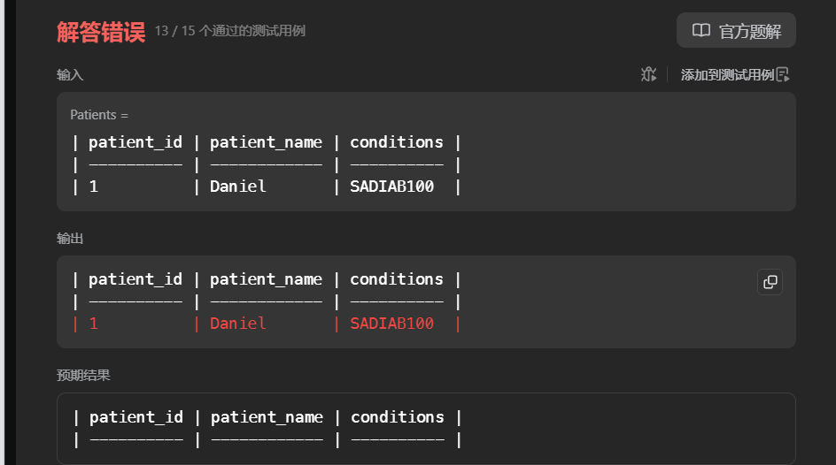

# Sql 基础50道

[高频 SQL 50 题（基础版） - 学习计划 - 力扣（LeetCode）全球极客挚爱的技术成长平台](https://leetcode.cn/studyplan/sql-free-50/)

# 高级字符串函数 

## [1667. 修复表中的名字 - 力扣（LeetCode）](https://leetcode.cn/problems/fix-names-in-a-table/description/?envType=study-plan-v2&envId=sql-free-50)

## [1527. 患某种疾病的患者 - 力扣（LeetCode）](https://leetcode.cn/problems/patients-with-a-condition/description/?envType=study-plan-v2&envId=sql-free-50)

问题：查一个字符串列表，含有指定前缀的字符串。

思路：要是就一个字符串，直接截取字符串前面的内容在比较就行，但是是字符串列表。那么把字符串列表当作一条字符传，如(str = "hnsqls  sqls ls") 模糊查询我们要的字段。


```sql
select *
from Patients
where conditions like '%DIAB1%'
```

发现错误



 思路问题：上述思路可以实现，对整个字符串的包含子段的数据。但是忽略了前缀。如数据

conditions='DIAB100 '

conditions='test DIAB100 '

conditions='testDIAB100 '

直接模糊都可以查询，都会查到，怎么解决？只匹配前缀。

可以只前缀模糊匹配查询。 后面的数据怎么模糊匹配前缀？可以使用空格代替 

```sql
# Write your MySQL query statement below

select *
from Patients
where conditions like 'DIAB1%' or  conditions like '% DIAB1%'
```

