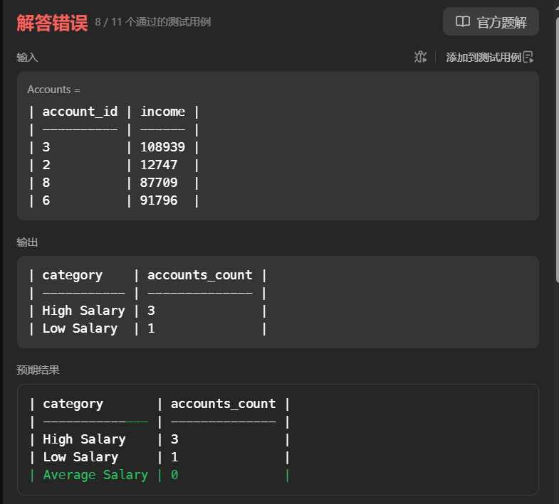
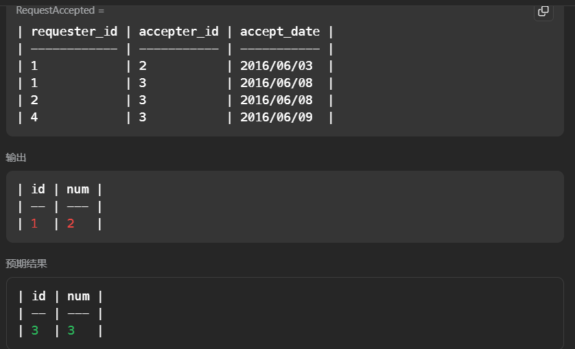
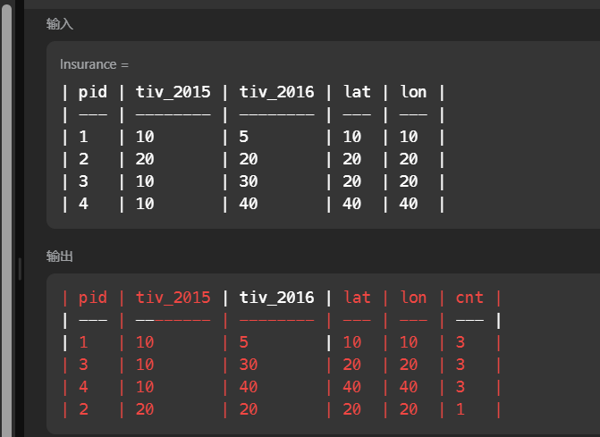
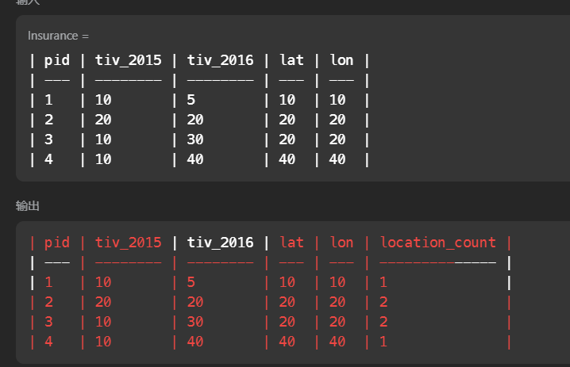
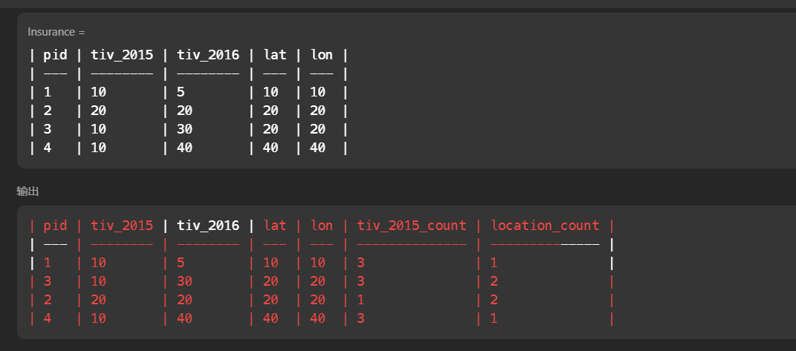
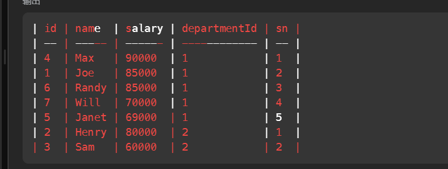
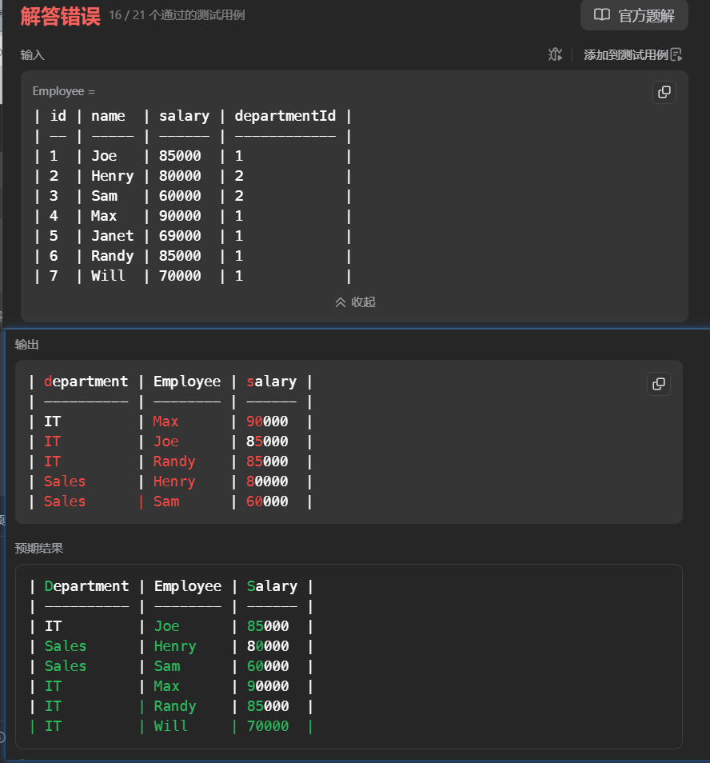
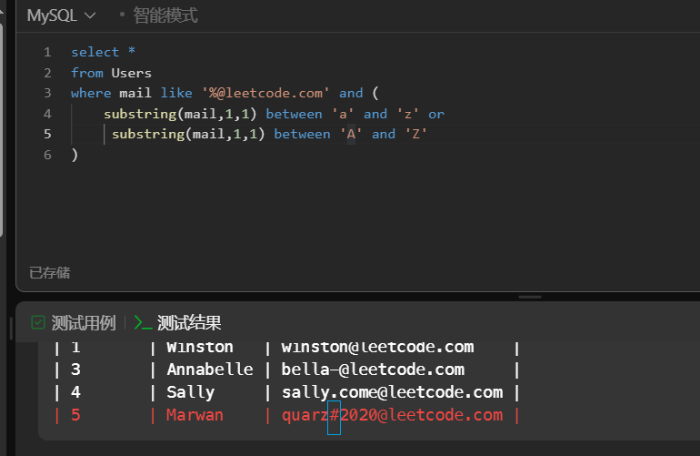

# Sql 基础50道

[高频 SQL 50 题（基础版） - 学习计划 全球极客挚爱的技术成长平台](https://leetcode.cn/studyplan/sql-free-50/)

# 高级查询和连接

## [1204. 最后一个能进入巴士的人 ](https://leetcode.cn/problems/last-person-to-fit-in-the-bus/?envType=study-plan-v2&envId=sql-free-50)

题目描述：

表记录乘客的id,weight,以及乘车顺序。找出最后一个上车但是不超载的人的信息

思路

* 根据顺序排序，每一行保留累加体重的值（如何累加行数据）（滑动窗口？ sum(weight) over (order by turn ) as total）
* 过滤出小于1000的累加值，降序排序获得第一个值的名称

```sql
select person_name 
from 
(
select *,
sum(weight) over (order by turn) as total
from Queue
)  as t
where t.total <= 1000
order by t.total desc
limit 1
```


## [1907. 按分类统计薪水 ](https://leetcode.cn/problems/count-salary-categories/description/?envType=study-plan-v2&envId=sql-free-50)

题目描述

​	表内容是银行账户，按照表数据的余额进行分组（低，中，高），统计每个分组类型账户的个数，没有就是0

思路

* 判断每行的数据在哪个位置分组的逻辑置为 1，2，3，然后分组统计1，2，3的个数。
* 为null 的置为0

一下有一个问题，就是第一次查询后，没有该level的逻辑数字，如下图

```sql
select 
case 
    when level = 1 then 'Low Salary'
    when level = 2 then 'Average Salary'
    when level = 3 then 'High Salary'
    end as category,
count(*) as accounts_count 
from(
    select *,
    case 
        when income < 20000 then  1
        when income < 50000 then  2
        else 3
    end as level
from Accounts
) as t
group by level
```

没有中间水平的账户，导致第一次查询，就没有该水平的逻辑表示，怎么办？--》不太会熟练使用unil all，




优化思路

* 分别统计低中高的数据
* 使用union all 连接

```sql
SELECT 
    'Low Salary' AS category,
    SUM(CASE WHEN income < 20000 THEN 1 ELSE 0 END) AS accounts_count
FROM Accounts

UNION ALL

SELECT 
    'Average Salary' AS category,
    SUM(CASE WHEN income BETWEEN 20000 AND 50000 THEN 1 ELSE 0 END) AS accounts_count
FROM Accounts

UNION ALL

SELECT 
    'High Salary' AS category,
    SUM(CASE WHEN income > 50000 THEN 1 ELSE 0 END) AS accounts_count
FROM Accounts;
```


# 子查询

## [602. 好友申请 II ：谁有最多的好友 ](https://leetcode.cn/problems/friend-requests-ii-who-has-the-most-friends/description/?envType=study-plan-v2&envId=sql-free-50)

题目描述

一个申请好友表，找出最多好友的人，以及人数。每个申请唯一

用户申请加好友------用户通过申请好友

思路      

* 好友的人数 = 自己主动加别人 + 别人加自己
* 自己主动加别人  根据请求用户id分组 计算 人数
* 别人主动加自己  根据审核用户id分组 计算 人数
* 获取用户id 对应的总好友数排序。 支取排序号的第一行


错误sql 如下

```sql
# Write your MySQL query statement bel

select req.requester_id as id, coalesce(request_num,0) + coalesce(acc_num,0) as num
-- select *
from (
    select *,count(*) as request_num
from RequestAccepted
group by requester_id
) as req
left join (
    select *,count(*) as acc_num
from RequestAccepted
group by accepter_id
) 
as acc
on req.requester_id = acc.accepter_id
order by  coalesce(request_num,0) + coalesce(acc_num,0) desc
limit 1
```

原因： 连接时候由于id =3 的用户没有加别人导致在主动加人的表中没有该id,链表的时候就丢弃了。没有直接支持保留两个表的数据及时没有匹配行




优化思路：

* 关系是双向的，我们可以收集所有参与关系的用户id，也就是作为请求者的用户id, 和作为接收者的用户id, 不去重，每出现一次就是一个关系，也就是好友个人。

```sql
SELECT id, COUNT(*) AS num
FROM (
    SELECT requester_id AS id FROM RequestAccepted
    UNION ALL
    SELECT accepter_id AS id FROM RequestAccepted
) AS t
GROUP BY id
ORDER BY num DESC
LIMIT 1;


```


## [585. 2016年的投资](https://leetcode.cn/problems/investments-in-2016/?envType=study-plan-v2&envId=sql-free-50)

题目描述

​	一个表中记录了2015，2016年的投保信息，找出2016年的投保总额，符合条件如下

1. 2015年投保金额至少与其他一人一样。
2. 他们的城市不能相同，（经纬度）


思路

*  题目要求，2015年的投保金额至少与1人一样，也就是根据2015年投保金额进行分组，组内个数等于1的就筛掉。
* 其次考虑过滤掉城市相同的数据，求和

实践中，上述要份为多部查询

优化思路

* 使用局部分组，这样分组的时候能保留未分组的数据
* 过滤取出位置分组数据大于1的数据


分布实现以下

第一步，局部分组，根据2015的投保金额分组,并且计算组的大小

```sql
select *,
count(*) over (partition by tiv_2015) as cnt
from Insurance
```

完成了分组计算每组数据大小的计算，还保留了未使用分组字段的数据



第二步，计算相同位置的数据，根据位置进行分组，同时使用局部分组，保留未分组的字段

```sql
select *,
count(*) over (partition by lat,lon) as location_count
from Insurance
```



上述两步，逻辑上是两步，但是可以同时做，所以优化。 （当然也可以量表连接获得 div_2015_count 和 location_count 的元素）

```sql
select *,
count(*) over (partition by tiv_2015) as tiv_2015_count,
count(*) over (partition by lat,lon) as location_count
from Insurance
```

可以看出，使用分组排序，原表的数据是没变的，只是在其后添加了一个我们指定的字段，



我们现在是需要过滤出tiv_2015_count >1 并且位置location_count = 1 的数据，注意保留2位小数

优雅

```sql
select round(sum(t.tiv_2016),2)as tiv_2016
from(
    select *,
    count(*) over (partition by tiv_2015) as cnt,
    count(*) over (partition by lat,lon) as location_count
from Insurance
) as t
where t.cnt >1 and t.location_count = 1
```


## [185. 部门工资前三高的所有员工](https://leetcode.cn/problems/department-top-three-salaries/description/?envType=study-plan-v2&envId=sql-free-50)

题目描述

​	两个表，员工薪水表， 以及部门表，要求找出每个部门薪水的前三员工

思路

* 根据部门，局部分组排序（降序），获得前三的数据
* 在连表获得部门的名称（输出的要求）


第一步：根据部门局部分组并且根据薪水排序（降序），获得前三的数据

```sql
# Write your MySQL query statement below
select *,
row_number() over (partition by departmentId order by salary desc) as sn
from Employee
```



第二步 获得每组前三的数据，连表整合数据

```sql
SELECT d.name AS department,e.name as Employee, e.salary
FROM (
    select *,
row_number() over (partition by departmentId order by salary desc) as sn
from Employee
) as e
JOIN Department d ON e.departmentId = d.id
WHERE e.sn <= 3
```



错误的原因是，题目要求的不同工资的前三，也就是说前三，人不一定是三个，但是不同的薪资是三个，比如上如IT部门前三有4个人，原因是有相同薪资的员工。

也就是我们的row_number() 排序有问题。 会导致相同的薪资有不同的排名，我们想要相同的薪资有i相同的排名，并且排名连续可以是用dense_rank()


优化的sql,  使用With AS   同时 修复 DENSE_RANK() 

```sql
WITH RankedEmployees AS (
    SELECT *,
           DENSE_RANK() OVER (PARTITION BY departmentId ORDER BY salary DESC) AS salary_rank
    FROM Employee
)
SELECT d.name AS department,e.name as Employee, e.salary
FROM RankedEmployees e
JOIN Department d ON e.departmentId = d.id
WHERE e.salary_rank <= 3

```


补充

* ROW_NUMBER()、DENSE_RANK() 和 RANK() 的区别详解

这三个都是SQL中的窗口函数，用于给数据行分配排名，但在处理相同值(并列情况)时有重要区别。
 核心区别对比表

| 函数             | 相同值处理                         | 排名序列                   | 示例输入值    | 示例输出排名 |
| :--------------- | :--------------------------------- | :------------------------- | :------------ | :----------- |
| **ROW_NUMBER()** | 相同值也分配不同排名               | 连续无间隔 (1,2,3,4)       | 100,100,90,80 | 1,2,3,4      |
| **DENSE_RANK()** | 相同值分配相同排名，不跳过后续数字 | 连续但可能有重复 (1,1,2,3) | 100,100,90,80 | 1,1,2,3      |
| **RANK()**       | 相同值分配相同排名，跳过后续数字   | 不连续可能有间隔 (1,1,3,4) | 100,100,90,80 | 1,1,3,4      |

# 高级字符串函数 

## [1667. 修复表中的名字 ](https://leetcode.cn/problems/fix-names-in-a-table/description/?envType=study-plan-v2&envId=sql-free-50)

## [1527. 患某种疾病的患者 ](https://leetcode.cn/problems/patients-with-a-condition/description/?envType=study-plan-v2&envId=sql-free-50)

问题：查一个字符串列表，含有指定前缀的字符串。

思路：要是就一个字符串，直接截取字符串前面的内容在比较就行，但是是字符串列表。那么把字符串列表当作一条字符传，如(str = "hnsqls  sqls ls") 模糊查询我们要的字段。


```sql
select *
from Patients
where conditions like '%DIAB1%'
```

发现错误


 思路问题：上述思路可以实现，对整个字符串的包含子段的数据。但是忽略了前缀。如数据

conditions='DIAB100 '

conditions='test DIAB100 '

conditions='testDIAB100 '

直接模糊都可以查询，都会查到，怎么解决？只匹配前缀。

可以只前缀模糊匹配查询。 后面的数据怎么模糊匹配前缀？可以使用空格代替 

```sql
# Write your MySQL query statement below

select *
from Patients
where conditions like 'DIAB1%' or  conditions like '% DIAB1%'
```


[196. 删除重复的电子邮箱 ](https://leetcode.cn/problems/delete-duplicate-emails/?envType=study-plan-v2&envId=sql-free-50)

问题：删除重复的字符串，只保留最小id的字符串

思路：

* 注意是删除，而不是选择

* 不重复的，不用修改,重复的删除，仅仅保留最小id的元素
* 那直接通过email分组，同时获去最小id。
* 使用not in  删除不是最小id的元素

错误示范 ： **MySQL 不允许在 `DELETE` 或 `UPDATE` 语句的子查询中直接引用目标表**。为了解决这个问题，我们需要将子查询的结果包装在一个临时表中。

```sql
delete from Person
where id not in
(
    select min(id) as id
    from Person
    group by email
)

```

正确：当作临时表，获取数据元素

```sql
delete from Person
where id not in
(
    select t.id
    from 
         (
          select min(id) as id
            from Person
             group by email
         ) as t 
)
```


## [176. 第二高的薪水 ](https://leetcode.cn/problems/second-highest-salary/?envType=study-plan-v2&envId=sql-free-50)

题目描述：

查找第二高的薪水，没有第二高就是null

思路

* 根据薪水分组+降序排序
* limit +offset + ifnull

```sql
# Write your MySQL query statement below
select 
ifnull(
    (
      select salary
      from Employee
      group by salary
      order by salary desc
      limit 1 offset 1
    )
, null
) as SecondHighestSalary
```

## [1484. 按日期分组销售产品 ](https://leetcode.cn/problems/group-sold-products-by-the-date/description/?envType=study-plan-v2&envId=sql-free-50)

题目描述：

查找出相同日期下，卖货的数量，以及数量名称的集合（按字典序排序），总体按日期排序，没有主键。

思路

* 根据日期分组排序，查出当天的，卖货数量（注意去重）。
* 商品名称集合要拼接，排序拼接,->想到了局部排序-但是最总还是要拼接

最终思路

* 根据日期分组排序，对产品去重，获得每组的数据，然后通过group_concat 对分组后不同行的字段进行拼接


tips: 函数 row_number() over (partition by coumle1 order by coumle2 desc) 局部排序给局部1，2，3排序

学习了更好的解法： 

将多行数据合并为一个字符串。

```sql
GROUP_CONCAT(
    [DISTINCT] 列名 
    [ORDER BY 排序字段 [ASC|DESC]]
    [SEPARATOR '分隔符']
)
```

```sql
select sell_date ,
count(distinct product) as num_sold ,
group_concat(distinct product order by product asc separator ',') as products
from Activities
group by sell_date

```


## [1327. 列出指定时间段内所有的下单产品 ](https://leetcode.cn/problems/list-the-products-ordered-in-a-period/description/?envType=study-plan-v2&envId=sql-free-50)

题目表述：

一个商品表，一个订单表，找出指定时间前，卖出商品超过100 的商品名称和商品数量

思路

* 连表，过滤出指定时间前的数据
* 根据商品id 分组计算出售商品数量
* 子查询过滤出商品超100的数量 ---》优化，直接having

```sql
# Write your MySQL query statement below
select product_name,
sum(unit) as unit
from Products p
join Orders o
on p.product_id = o.product_id
where order_date <= '2020-02-29' and order_date >= '2020-02-01'
group by p.product_id
having unit >=100
```

## [1517. 查找拥有有效邮箱的用户 ](https://leetcode.cn/problems/find-users-with-valid-e-mails/description/?envType=study-plan-v2&envId=sql-free-50)

题目描述：

查找符合要求的邮箱，要求结尾以@leetcode.com，开头只能以字母开头。

思路

* 模糊匹配后端
* 截取前缀判断是否在英文字母范围


```sql
select *
from Users
where mail like '%@leetcode.com' and (
    substring(mail,1,1) between 'a' and 'z' or
     substring(mail,1,1) between 'A' and 'Z'
)
```



出错，没考虑其他字符。所以还是只用正则表达式

优化思路 ：正则表达式

```sql
SELECT *
FROM Users
WHERE mail regexp '^[a-zA-Z][a-zA-Z0-9_.-]*@leetcode\\.com$'
```

正则的起始^ 结尾$

[] 用户模糊匹配的字段